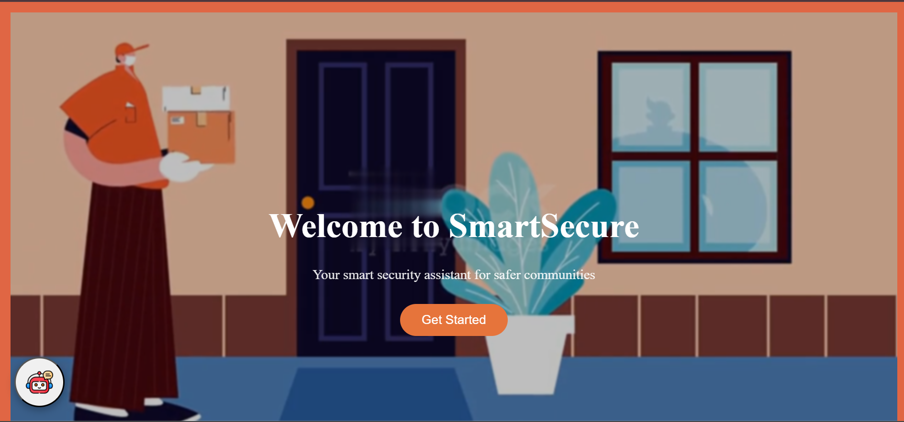
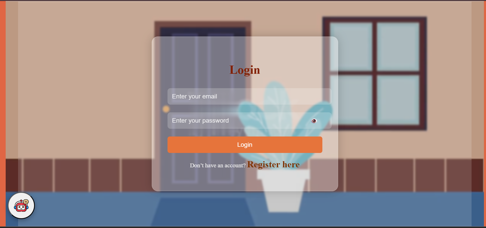
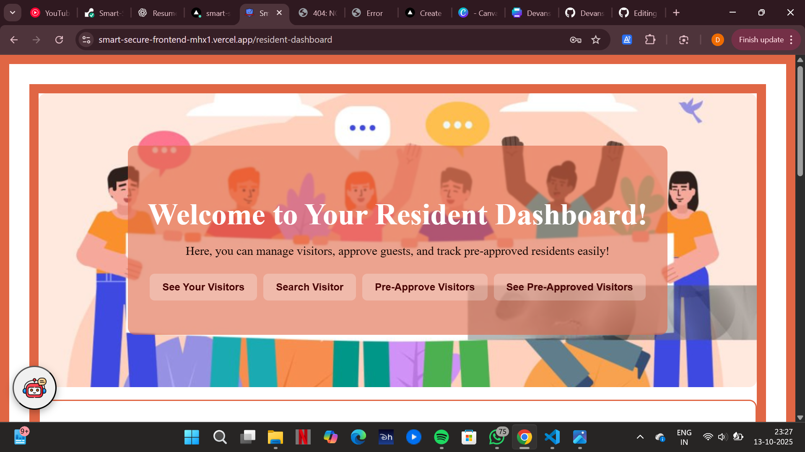
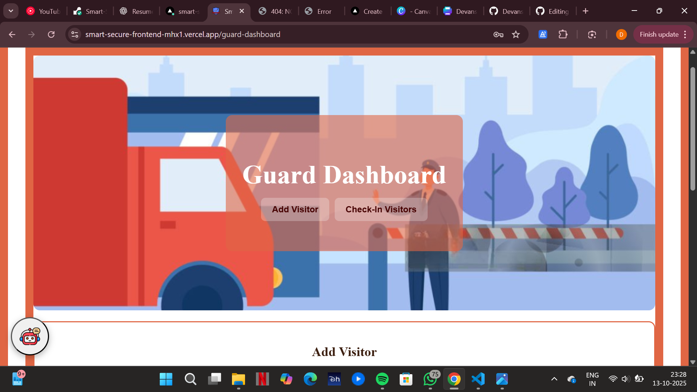

# 🛡️ Smart Secure — AI-Powered Security Management System

**Smart Secure** is a full-stack **MERN-based security management web app** designed to create safe, efficient communication between **guards, residents, and admins**.  
It integrates **AI assistance**, **role-based access control**, and **JWT authentication** to deliver a real-time, secure, and intelligent experience for modern residential communities.

---

## 📌 Features

- 👮 **Role-Based Access Control (RBAC):** Separate dashboards for Admin, Guard, and Resident.  
- 🔐 **JWT Authentication:** Cryptographic user login and authorization for secure access.  
- 💬 **AI Assistant Integration:** Built-in AI assistant for quick alerts, intelligent replies, and assistance.  
- 📋 **Activity Management:** Real-time updates and interaction between all roles.  
- ⚙️ **Scalable Architecture:** Modular Node.js backend and reusable React components ensure scalability.  
- 🌐 **Deployed on Vercel (Frontend)** and **Render (Backend)** with CI/CD for automated deployment.  

---

## 🛠 Tech Stack

- **Frontend:** React.js, Vite, Tailwind CSS, Axios  
- **Backend:** Node.js, Express.js, MongoDB, JWT  
- **AI Integration:** OpenAI API  
- **Hosting:** Vercel (Frontend) + Render (Backend)  

---

## 📸 Screenshots

  
*Secure Login page for users.*

  
*User registration with encrypted credentials.*

  
*Resident dashboard with activity tracking and communication.*

  
*Guard dashboard to manage entries and visitor logs.*

---

## 🎯 Live Link

🚀 **Live Demo:** [Smart Secure App](https://smart-secure-frontend-mhx1.vercel.app/)  
💻 **Backend Repo:** [Smart Secure Backend](https://github.com/DevanshiSingh22/Smart-Secure-backend)

---

## 📬 Let’s Connect

📧 malikdevanshi22@gmail.com  
🔗 [GitHub](https://github.com/DevanshiSingh22) 

⭐ Don’t forget to **star** this repository if you found it useful!
